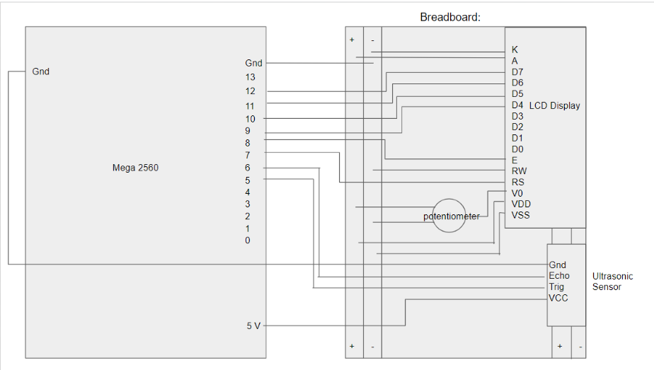
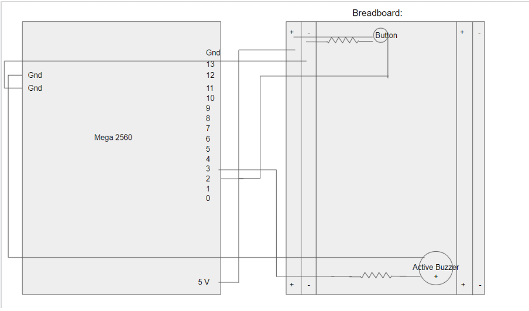
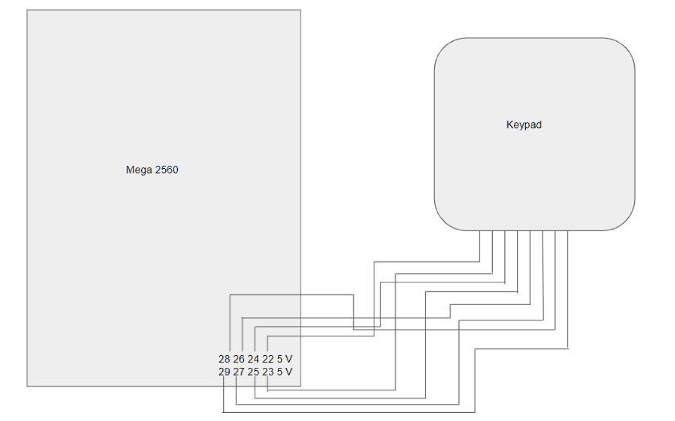

# Campus Seat System

CS122A (Intermediate Embedded & Real-Time Systems) - Project 1  
Created by Linda Ly

## What is the project? What is the purpose?
The purpose of this project is to help students at any college campus find seats where they can sit. It is very common for students to have class schedules where they have big gaps in between classes. Therefore, they need somewhere to sit in between those classes. This project helps them pick what location they are interested in sitting at, and looking at if there are any available seats there. If there is, they can go to that location by walking. If not, they can pick their second preferred location and see if there are any available seats there. They would continue to do this until they find a location where they can sit. This helps them avoid having to walk to different locations looking for some place to sit, not finding one, and then having to walk someplace else.  

It also helps them not waste time trying to find somewhere to sit because all college students are busy and should spend more of their time on assignments, labs, projects, etc. rather than worrying about where they are going to sit. The reason why I came up with this idea is because this terrible experience has happened to me a lot. Finally, one day, when I spent 30 minutes looking for a seat and didn’t find any, I had my breaking point and came up with this idea.  

Another purpose of this project is for students to reserve seats if they feel like they can’t get to a location before all seats are taken there, especially if there is only one seat left at that location. It would be unfair if one student who plans on sitting there first doesn’t get to just because their previous class is a little farther than another student’s. This project helps with the fairness in seats taken at college campuses.  

## Functionality
First, we start out with the first location, the HUB. You can press a button to switch locations on campus (seen in recorded demo). It shows how many available, reserved, and taken seats there are at the HUB. When I press ‘A’ on the keypad, it reserves a seat for me. Now, the number of reserved seats goes up by 1 and the number of available seats goes down by 1. Then, it will give me a code to input once I’m at the seat to make sure I’m really the owner of that reserved seat. I can press ‘ * ’ to enter that code, and once I do, that reserved seat is now taken. If I press ‘B’ on the keypad, I am intentionally, as the reserved seat owner, giving up that reserved seat. Therefore, the number of reserved seats goes down by 1 and the number of available seats goes back up by 1. I can also press ‘C’ to give up a taken seat and it goes back to being available. If you mess up inputting the code, you can press ‘D’ which brings you back to the main menu and you can start again by pressing ‘*’.  I can press ‘A’ again to reserve another seat and I will get another code. This process is the same for every location as you switch through them (SSC, Rivera, and Orbach). As you take or reserve a seat, there will be 1 beep played on an active buzzer so you know you have done it successfully. As you give up a reserved seat or taken seat, there will be 2 beeps so you know you have done it successfully. In addition, there is an ultrasonic sensor that acts as the sensor for one specific seat at a location. If someone gets too close to it, the sensor senses it and assumes there is someone sitting there (the seat becomes taken). If it senses that nothing is there anymore, it assumes the person got up and the seat becomes available again.

## Hardware Design Schematics/Block Diagrams

## How This Was Tested
This project has been tested throughout the development of it. The first thing I tested was that every component of my project actually works. For example, I tested that the 16x2 LCD display that I am using actually works by printing out random messages on it. Then, I tested that each component actually works in response and coordination to each other. If I didn’t do this, I would have found out that it wasn’t working too late into the project and it would be too late to do anything about it. For example, I tested that the LCD display is compatible with the keypad by having a press on the keypad trigger some output on the LCD display. This really helped me avoid more troubles as I progressed further into my project.  

Next, I moved onto the software part of the project. As I wrote a small snippet of code for each feature, I would compile it and upload it to the Arduino. Then, I would make sure that bit of code actually works before moving on to write more code that implements more features. Although this took a bit of time to do, I believe it has saved me in the long run where I would’ve had to debug for a longer period of time if I didn’t do this. Testing included asking questions to myself such as, “What happens if I press this button?” or “What output should I see on the LCD display if I enter this key on the keypad?” Thus, I proceeded appropriately based on my methods for testing out my project. 

## Challenge/Lessons Learned
While doing this project, I have run into quite a few challenges. Some challenges made me wonder if I was the one in the wrong with my software and hardware set up or if there was actually something wrong with the Arduino software and hardware itself.  

For example, when first working with the keypad, I had a lot of challenges. When I first started testing it out, to see if it works, I used a simple program that was just supposed to serially print out the key I pressed. However, when I pressed a key, the key wouldn’t print. Therefore, I guessed it was more likely that there was something wrong with my code rather than there being something wrong with the keypad itself. I tried debugging, but I couldn’t figure it out, so I figured there was something with the hardware set up. I looked at YouTube tutorials to see how other people set it up and my set up was just like theirs except using different pins. I figured that using different pins wouldn’t be a problem as long as I specified that in the software. Finally, I decided that there must be a problem with the keypad itself. I switched to the keypad I used in CS120B and it still wasn’t working. Next, I looked at my software again and tried debugging again. Finally, I fixed the bug and was able to see the key print. Challenges like this were a big part of my project development process.  

Another challenge I experienced was trying to balance working on this project, working on assignments, labs, projects, etc. for other classes, actually attending those classes, and taking care of myself (eating, sleeping, etc.). I thought that I would be able to do it, but it was still a challenge because often times, I would underestimate how long certain things would take me. This leads me into the lessons I have learned while doing this project.  

Another challenge I experienced was tradeoffs. One tradeoff I had to make was using a button vs. using the keypad. I could’ve either implemented the “reserve a seat” feature by having the user press a button or press a key on the keypad. The button is clearer to the user, but I had to deal with button debouncing and the fact that buttons come loose on my breadboard a lot. The key to press on the keypad is a little less obvious to the user, but I don’t have to deal with button debouncing and it coming loose. In the end, I decided to go with the keypad because it would be better for it to work correctly with a little confusion (using the keypad) than for it to not work at all (with the button).  

Another tradeoff I experienced was getting a bigger LCD display vs. possibly unclear messages to the user using the 16x2 LCD display I already have. If I had gotten the bigger one, I would be able to give clearer directions and messages to the user, but it’s more expensive. However, the 16x2 LCD display I already have limits what I can say, but at the same time, it’s cheaper. In the end, I chose to go with the 16x2 LCD display because saving money is more important to me. Still though, I tried to give the clearest messages I could through the 16x2 LCD display.  

One of the lessons I’ve learned is time management. I think I should be overestimating how long things will take me just in case I actually spend more time on something than I thought I would. With better time management, I think the whole development of the project would have been smoother for me.  

Another lesson I learned is that I should be debugging with a clear mind and that if I don’t have a clear mind (due to exhaustion and stress), I should take a break. A lot of the time, when I ran into bugs, I would sit there for a while trying to fix it, but ended up not being able to. Then, when I would get a drink of water or go to the bathroom, an idea of what a possible mistake could be pops into my head. Often, it was that mistake that ended up being the cause of the bug. 

## Additional Documentation

Included in this link is a more detailed look at the project development.

https://drive.google.com/drive/folders/1CwUY-y-bgFDhTj8Xi_DT23CsRyeU-6gK?usp=sharing 

